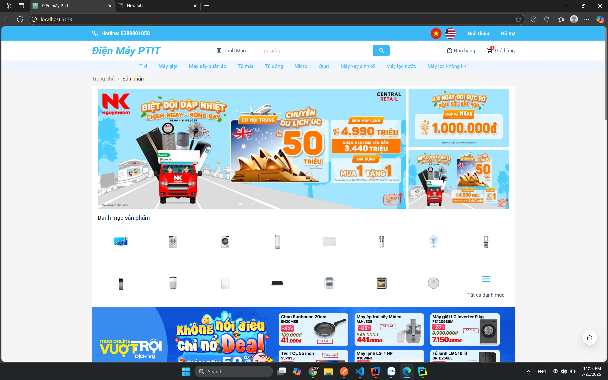

# 🏠 Web Bán Hàng Đồ Gia Dụng

**Web Bán Hàng Đồ Gia Dụng** là hệ thống website thương mại điện tử được phát triển với **Spring Boot** cho backend và **ReactJS** cho frontend. Dự án hỗ trợ đầy đủ các chức năng phục vụ quá trình bán hàng, từ quản lý sản phẩm đến xử lý đơn hàng và thanh toán.

---

## 🚀 Công nghệ sử dụng

### 🔧 Backend – Spring Boot

- Java 21+
- Spring Boot 3.x
- Spring Security (xác thực & phân quyền)
- Spring Data JPA (kết nối cơ sở dữ liệu)
- RESTful API
- JWT Authentication
- PostgreSQL

### 💻 Frontend – ReactJS

- React 19+
- React Router
- Axios (gọi API)
- Tailwind CSS (giao diện hiện đại, responsive)

---

## 🌟 Tính năng chính

### 👤 Dành cho người dùng (khách hàng)

- 🔍 Xem danh mục và chi tiết sản phẩm
- 🧭 Tìm kiếm, lọc theo loại và giá
- 🛒 Thêm sản phẩm vào giỏ hàng
- 💳 Đặt hàng và thanh toán
- 📜 Xem lịch sử đơn hàng
- 🔐 Đăng ký / Đăng nhập

### 🛠️ Dành cho quản trị viên

- 🗂️ Quản lý danh mục (thêm / sửa / xóa)
- 📦 Quản lý sản phẩm (thêm / sửa / xóa)
- 📬 Quản lý đơn hàng (xác nhận, hủy, cập nhật trạng thái)
- 👥 Quản lý người dùng
- 📊 Thống kê doanh thu và sản phẩm bán chạy

---

> 💡 Dự án này phù hợp cho việc học tập và phát triển các kỹ năng lập trình fullstack với React và Spring Boot.

### 📸 Giao diện minh họa

